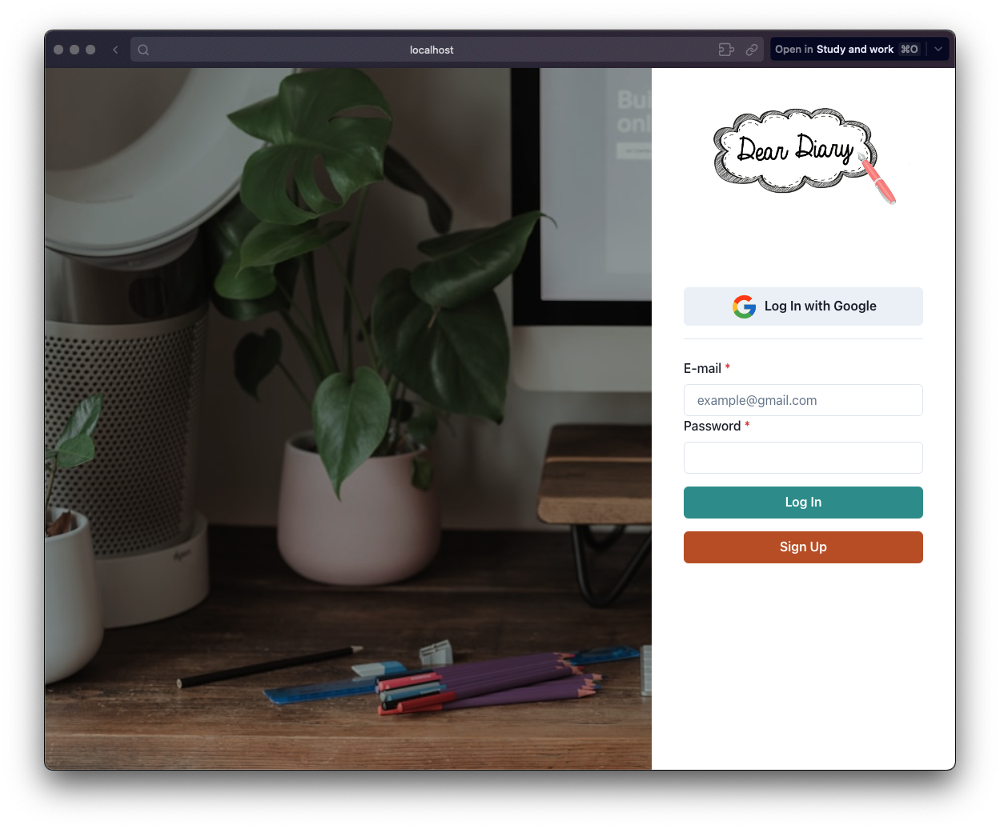
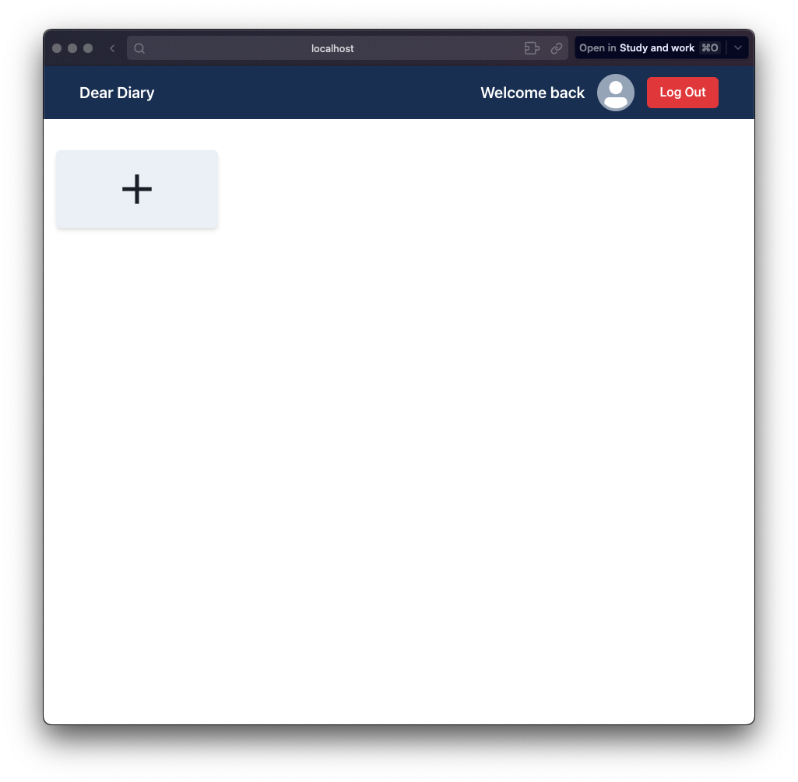
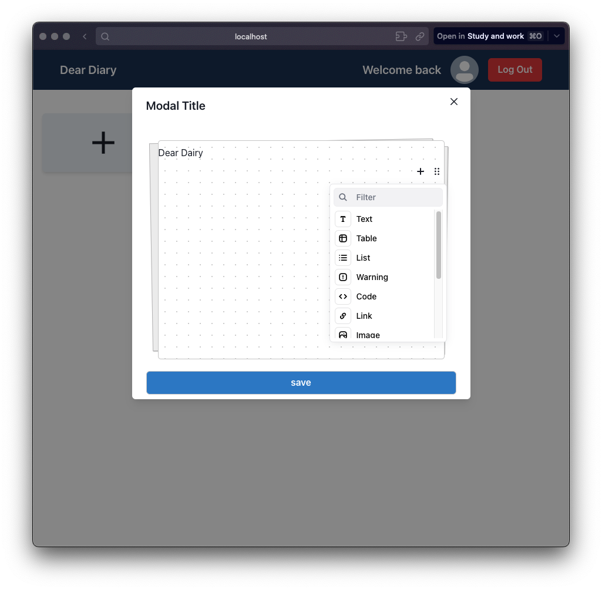
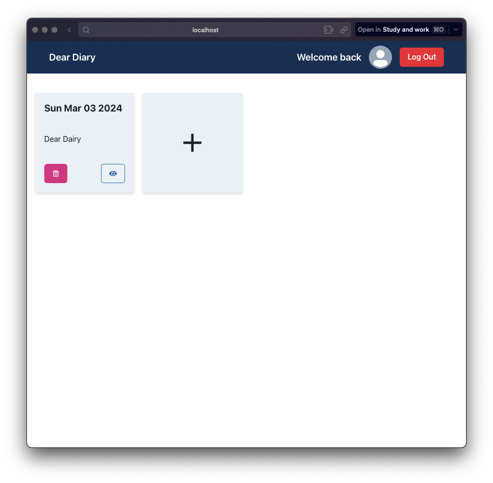

# Dear Dairy - A simple diary app

[visit page 🔗](https://dairy-3d2a4.web.app/)

if you want to test the app, you can use the following credentials:

```
username: root@gmail.com
password: 123456789
```

## Description

A simple diary app built with React, Vite, Firebase, Editor.js and etc. This project is a part of my API project for HackYourFuture. The goal of this project is to build a simple diary app that allows users to create, read, update and delete their diary entries. The app also allows users to upload images and videos to their diary entries.

# Images






---

## How to setup the project

- Clone the repository
- Run `npm install` to install all the dependencies
- Create a new project in firebase and enable google authentication
- Create a new web app in firebase and copy the firebase config
- Create a new file called `.env` in the root of the project and add the following environment variables
  ```
  VITE_FIREBASE_API_KEY=your-firebase-api-key
  VITE_FIREBASE_AUTH_DOMAIN=your-firebase-auth-domain
  VITE_FIREBASE_PROJECT_ID=your-firebase-project-id
  VITE_FIREBASE_STORAGE_BUCKET=your-firebase-storage-bucket
  VITE_FIREBASE_MESSAGING_SENDER_ID=your-firebase-messaging-sender-id
  VITE_FIREBASE_APP_ID=your-firebase-app-id
  VITE_FIREBASE_MEASUREMENT_ID=your-firebase-measurement-id
  ```
- Run `npm run dev` to start the development server

## Features

- [x] Add diary entry.
- [x] Login with Google.
- [x] Upload images and videos.
- [x] Update diary entry.
- [x] Delete diary entry.
- [x] Read diary entry.
- [ ] Search diary entry.
- [ ] Filter diary entry by date.
- [ ] Filter diary entry by mood of the day.
- [ ] Filter diary entry by tags.
- [ ] Filter diary entry by people.

## Tech Stack

- [React](https://reactjs.org/)
- [Vite](https://vitejs.dev/)
- [Netlify](https://www.netlify.com/) / [Firebase](https://firebase.google.com/)
- [React Router](https://reactrouter.com/)
- [React Icons](https://react-icons.github.io/react-icons/)
- [sass](https://sass-lang.com/)
- [editor.js](https://editorjs.io/)
- [chakra-ui](https://chakra-ui.com/)
- [firebase](https://firebase.google.com/)
- [unsplash-api](https://unsplash.com/developers)

## License

[MIT](https://choosealicense.com/licenses/mit/)

# Known Bugs

- [x] Login with email and password is not working. (Fixed)
- [ ] sometimes login with google is not working on mobile devices.
- [ ] image upload is not working in Editor.js.
- [ ] Header is not working properly in Editor.js.
